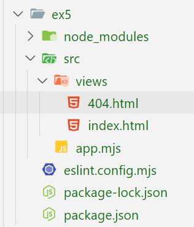
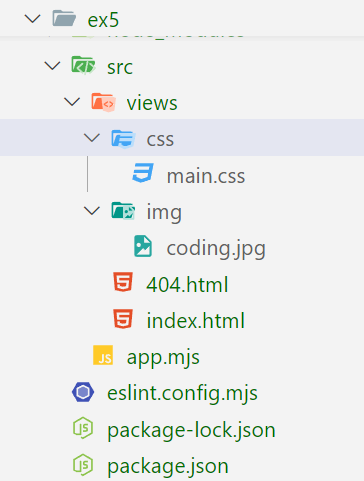

# Exercice 5 : serveur Web avec les pages HTML

1. Initialisez un nouveau projet avec npm en y ajoutant le module ***ESLINT***.
2. Créez un **serveur Web** qui permet de rendre le contenu d'une ***page HTML*** à partir de la route /

## Spécifications techniques

- Le serveur écoute sur le ***PORT 5000***
- Créez un dossier src contenant les views (views = vues = pages, css, images, etc.)
- Le dossier views contient ***2 pages HTML***, ***index.html*** et ***404.html*** cf. arborescence ci-dessous
- Renvoyez la page ***index.html*** lorsqu'une requête est envoyée sur la route */*
- Renvoyez la page ***404.html*** lorsqu'une requête est envoyée sur une *autre route que /*
- Utilisez les modules ***`node:fs`, `node:http` et `node:path`***
- Utilisez les méthodes *resolve()* et *join()* 
pour construire vos chemins absolus et relatifs pour charger les différents 
fichiers nécessaires pour charger les différents fichiers css, images, etc.
- Vous auriez besoin de la fonction [fileURLToPath](https://nodejs.org/api/url.html#urlfileurltopathurl-options)

## Arborescence dossiers

---

## BONUS

1. Chargez un fichier ***CSS*** dans la page *index.html*
- Ajoutez un dossier `css` dans `src` dédié à l'emplacement des fichiers ***.css***
- Ajoutez le lien de votre fichier *CSS* dans la page ***index.html***
2. Faites la même en chose  pour charger dans la page ***index.html*** une image présente dans le dossier ***src/img***

## Arborescence dossiers avec le bonus

