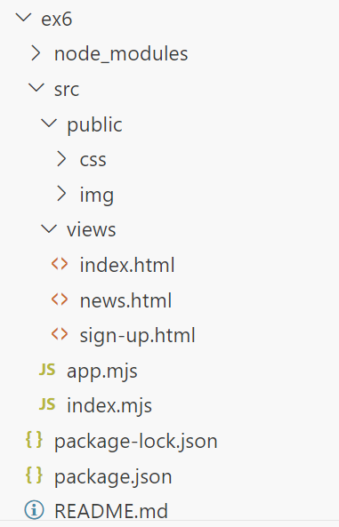

# Exercice 6 : Express

## Enoncé

1. Installez *Express* de manière globale pour accéder de partout à la commande `express` (ça sera utile pour l'exercice 7, pour cet exercice nous allons utiliser le module express et pas encore *Express CLI*)
2. Créez un projet Express en téléchargeant le module de manière locale grâce à une commande *npm*
3. [Récupérer les pages HTML depuis ce dossier compressé](./ressources/ex6.zip) et reproduisez l'arborescence des dossiers et fichiers illustré ci-après.
4. Mettez en place les routes pour les pages de *connexion*, *inscription* et de *news* avec Express

## Spécifications techniques 

- L'application tourne sur le ***PORT 8060***
- Toutes requêtes ci-dessous sont à faire avec la ***méthode HTTP GET***
- Pour accéder à la page de connexion, la route est `/`
- Page inscription `/sign-up`
- Page de news `/news`

## Arborescence des dossiers

