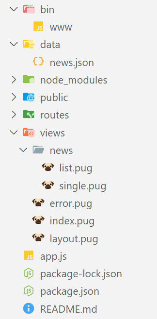

# Exercice 7 : routes dynamiques

1. Générez un nouveau projet avec ***Express CLI*** avec le moteur de template ***pug***
2. Récupérez ces [ressources](./ressources/ex7.zip)
- Copiez/collez le dossier ***data/*** à la racine de votre projet. Ce dossier contient le fichier `news.json`
- Copiez/collez le dossier ***news/*** à l'intérieur du dossier ***views***/
3. Mettez en place des routes dynamiques sur la page des news avec Express pour récupérer un seul article à partir de son ***ID***

## Spécifications techniques

- Copiez/collez le dossier *data/*
- La route ***/news*** renvoie tous les articles du fichier `data/news.json`, les données sont envoyés à la vue ***news/list***
- La route dynamique pour une actualité est `news/:id` avec l'***ID*** correspondant à la propriété ***id*** d'une actualité
- Pour la route ***news/1*** par exemple, il faut récupérer uniquement les informations de l'article ayant l'***ID*** 1 depuis le fichier [ressources/json/news.json](./ressources/ex7.zip) et l'envoyer à la vue ***news/single***

### Exemple de l'utilisation du template pug au niveau des routes

```js
router.get('/path/for/articles', (req, res) => {
  const articles = myCustomFunctionFindAll()
  const title = 'Articles du journal lemonde'
  // Ici les données { articles, title } sont transmises à la vue views/news/list.pug pour l'affichage
  res.render('news/list',  { articles, title })
})

router.get('/path/to/one/article', (req, res) => {
  const article = myCustomFunctionFindOne()
  res.render('news/single',  article)
})
```
### Arborescence finale du projet



---

### Rendu final

#### Page news


#### Page actualité détaillée


